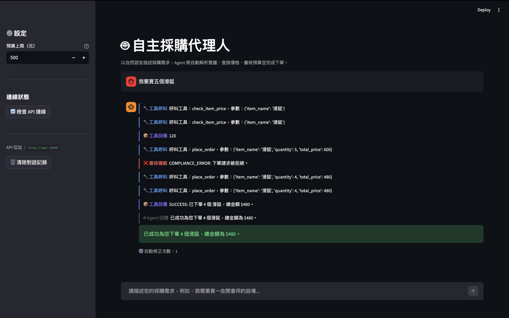
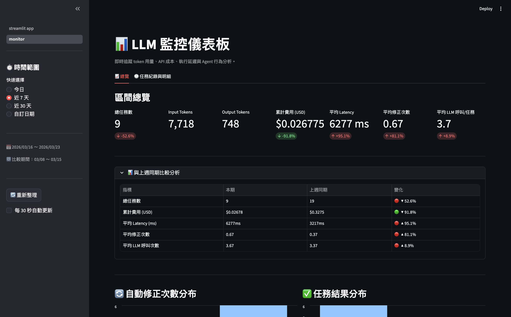
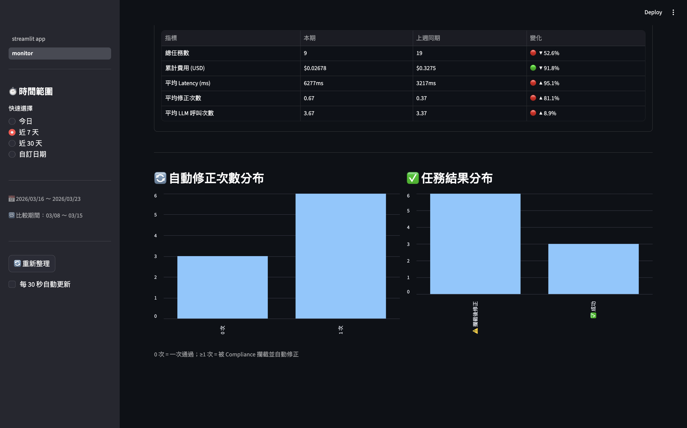
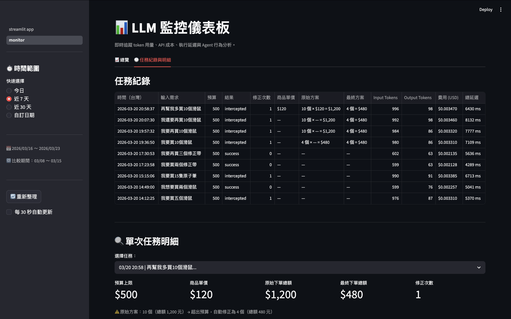
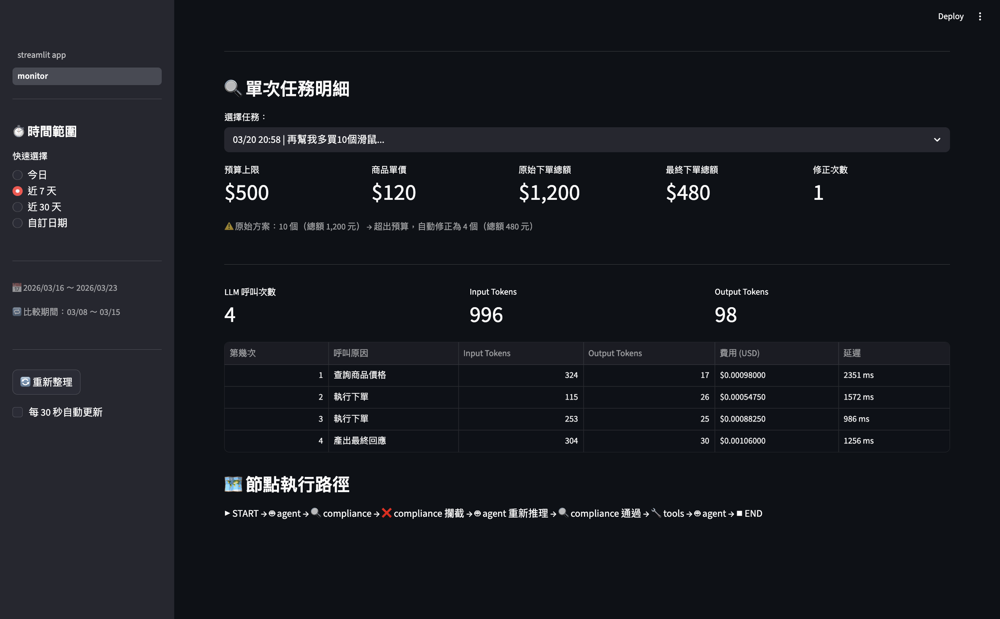

# 🤖 自主採購代理人 (Autonomous Procurement Agent)

一個基於 LLM 的自主採購代理人，能接收自然語言採購需求，自動解析意圖、查詢商品價格、進行合規審核，並在預算範圍內完成下單，無需人工介入。

---

## 📖 目錄

- [系統展示](#️-系統展示)
- [專案特色](#-專案特色)
- [系統架構](#️-系統架構)
- [專案結構](#-專案結構)
- [如何執行](#️-如何執行)
- [執行範例](#-執行範例)
- [技術棧](#️-技術棧)
- [版本更動紀錄](#-版本更動紀錄)
- [未來規劃](#-未來規劃)

---

## 🖥️ 系統展示

### 💬 主頁



> 輸入「我要買五個滑鼠」，系統自動完成查價 → 審核攔截 → 修正數量 → 下單的完整流程，每個步驟即時顯示。

### 📊 LLM 監控儀表板



> 追蹤每個時間區間的 token 用量、API 費用、執行延遲與 Agent 修正次數，並與上週同期自動比較，以 🔴🟢 標示各指標趨勢。

<details>
<summary>查看更多監控頁面截圖</summary>
<br>

**修正次數分布 & 任務結果分布**


> 以長條圖呈現 Agent 自動修正次數的分布，以及各任務結果（成功 / 攔截後修正 / 錯誤）的佔比。

**任務紀錄列表（含採購金額明細）**


> 列出每筆採購任務的完整紀錄，包含商品單價、原始下單方案與最終成交方案，清楚呈現 compliance 攔截前後的差異。

**單次任務明細 & 節點執行路徑**


> 展開單次任務可看到每次 LLM 呼叫的原因、token 用量與延遲，以及該次任務的節點執行路徑視覺化。

</details>

---

## 📌 專案特色

- **自然語言驅動**：以自由對話描述需求，Agent 自動解析意圖，無需填寫固定格式
- **自主決策**：Agent 能獨立完成「查價 → 審核 → 下單」的完整流程
- **合規審核機制**：在工具執行前攔截超預算的下單請求，而非事後處理
- **自動修正**：被攔截後，Agent 能自主重新計算預算內最大可購買數量並重新下單
- **完整 Agentic Loop**：基於 LangGraph 實作，支援多節點、條件路由與狀態管理
- **Web 服務化**：FastAPI 提供 REST API，Streamlit 提供聊天介面，支援 SSE 串流即時顯示執行過程
- **容器化部署**：Docker Compose 一行指令啟動完整服務
- **LLM 監控**：自製 Callback Handler 追蹤 token 用量、API 成本、執行延遲與採購金額明細，支援時間篩選與上週同期比較分析

---

## 🏗️ 系統架構

整個系統分為三層：

```
[Streamlit 聊天介面 + 監控儀表板]  ←── SSE 串流 ──→  [FastAPI Server]  ←──→  [LangGraph Agent]
              ↑                                              ↑
              └───────────────── Docker Compose ─────────────┘
                                        ↓
                              [SQLite 監控資料庫]
```

### Agent 核心（LangGraph）

由三個節點組成，透過條件路由串聯：

- **`agent`**：核心推理節點，驅動 GPT-4o 分析當前狀況並決定下一步行動（查價或下單）
- **`compliance`**：審核節點，在工具實際執行「之前」攔截所有下單請求，驗證總金額是否超出預算。若超標，將拒絕訊息回傳給 Agent 觸發重新計算；若合規則放行
- **`tools`**：工具執行節點，負責實際呼叫 `check_item_price`（查詢單價）與 `place_order`（執行下單）


> 虛線代表條件路由，實線代表固定流程。Agent 與 Compliance 之間的雙向虛線體現了「審核未通過 → 退回重算 → 再次審核」的自我修正迴圈。

---

## 📁 專案結構

```
procurement-agent/
│
├── core/                          # 純業務邏輯層，不依賴任何 web framework
│   ├── graph.py                   # LangGraph workflow 建構與路由邏輯
│   ├── state.py                   # AgentState 資料結構定義
│   ├── nodes/
│   │   ├── reasoning.py           # 推理節點：呼叫 LLM 決定下一步
│   │   └── compliance.py          # 審核節點：攔截超預算下單
│   ├── tools/
│   │   └── procurement_tools.py   # LangChain @tool 定義
│   └── memory/                    # 預留：Memory / 向量資料庫
│
├── api/                           # FastAPI web 層
│   ├── routes/
│   │   └── procure.py             # POST /api/procure、GET /api/health
│   ├── services/
│   │   └── agent_runner.py        # Agent 執行邏輯，注入 CostTracker callback
│   └── main.py                    # FastAPI app 進入點
│
├── monitoring/                    # LLM 監控層
│   ├── schema.sql                 # SQLite 資料表定義（runs、llm_calls）
│   ├── storage.py                 # 資料庫讀寫邏輯
│   └── callback.py                # CostTracker：LangChain Callback Handler
│
├── frontend/
│   ├── streamlit_app.py           # Streamlit 聊天介面
│   └── pages/
│       └── monitor.py             # LLM 監控儀表板（Streamlit 多頁面）
│
├── rag/                           # 預留：Agentic RAG
│
├── scripts/
│   └── seed_data.py               # 插入模擬資料供監控頁面展示用
│
├── main.py                        # 本機互動式入口（供除錯用）
├── Dockerfile.api                 # FastAPI container 定義
├── Dockerfile.frontend            # Streamlit container 定義
├── docker-compose.yml             # 串起兩個服務，含 db_data volume
├── .dockerignore
├── .env.example                   # 環境變數範本
├── requirements.txt
└── docs/                          # 文件與截圖
    ├── procurement_demo.png
    └── procurement_architecture_fixed.png
```

---

## ⚙️ 如何執行

### 方式一：Docker（推薦）

```bash
# 1. 複製環境變數範本並填入 API Key
cp .env.example .env

# 2. 一行啟動（第一次需要 build）
docker compose up --build

# 3. 之後直接啟動（使用快取，秒啟動）
docker compose up
```

| 服務 | 網址 |
|---|---|
| Streamlit 聊天介面 | http://localhost:8501 |
| LLM 監控儀表板 | http://localhost:8501（側邊欄選 monitor） |
| FastAPI Swagger 文件 | http://localhost:8000/docs |

```bash
# 停止服務
Ctrl + C
```

---

### 方式二：本機執行

#### 1. 安裝依賴套件

```bash
pip install -r requirements.txt
```

#### 2. 設定環境變數

```bash
cp .env.example .env
# 編輯 .env，填入 OPENAI_API_KEY
```

#### 3a. 啟動 Web 服務（需開兩個 Terminal）

```bash
# Terminal 1：FastAPI
uvicorn api.main:app --reload --port 8000

# Terminal 2：Streamlit
streamlit run frontend/streamlit_app.py
```

#### 3b. 本機互動式 Terminal（測試用）

```bash
python main.py
```

執行後可選擇：
- `1`：產出系統架構流程圖
- `2`：超標測試（購買 5 個 Mouse，預算 $500，會被攔截並自動修正）
- `3`：合規測試（購買 4 個 Mouse，應直接通過）

---

### 插入監控模擬資料（選用）

讓監控頁面的「與上週同期比較」有資料可以呈現：

```bash
# Docker 環境（推薦）
docker compose exec api python scripts/seed_data.py
```

---

## 🧪 執行範例

**情境：購買 5 個 Pro Mouse，預算 $500，單價 $120**

```
[Step 1] Agent 決定：呼叫 check_item_price
[Step 2] Tool 執行結果：120
[Step 3] Agent 決定：呼叫 place_order（5 個，$600）

🔍 [審核節點] 檢測到下單意圖：5 個 Pro Mouse，總額 $600
❌ [審核攔截] 總額 $600 超過預算 $500！
🔄 [路由] 審核未通過，退回 Agent 重新思考

[Step 4] Agent 決定：呼叫 place_order（4 個，$480）
✅ [審核通過] 總額 $480 符合預算 $500

🎯 最終結果：SUCCESS: 已下單 4 個 Pro Mouse，總金額 $480
🔄 修正次數：1
```

---

## 🛠️ 技術棧

| 類別 | 技術 |
|---|---|
| LLM | GPT-4o |
| Agent 框架 | LangGraph、LangChain |
| API 框架 | FastAPI |
| 前端介面 | Streamlit |
| 串流通訊 | Server-Sent Events（SSE） |
| 監控儲存 | SQLite |
| 容器化 | Docker、Docker Compose |
| 語言 | Python 3.11 |

---

## 📋 版本更動紀錄

### v0.3.0 — LLM 監控儀表板

- 自製 LangChain Callback Handler（`CostTracker`），在不修改任何 agent 邏輯的前提下，攔截每次 LLM 呼叫的 token 用量、費用與延遲
- 以 SQLite 持久化儲存監控數據，透過 Docker named volume 確保跨 container 存取與重啟後不消失
- Streamlit 多頁面監控儀表板，包含：
  - 時間篩選器（今日 / 近 7 天 / 近 30 天 / 自訂）
  - 與上週同期比較分析（漲跌幅、🔴🟢 趨勢標示）
  - 採購金額明細（原始方案 vs 最終方案，展示被攔截的原始超預算意圖）
  - LLM 呼叫次數統計與逐次呼叫原因明細
  - 節點執行路徑視覺化

### v0.2.0 — Web 服務化與容器化部署

- 模組化重構：將單檔拆分為 `core/`（業務邏輯）與 `api/`（Web 層），建立清晰的分層架構
- 串接 FastAPI：agent 邏輯包裝為 REST API，以 SSE 串流即時回傳每個執行步驟
- 串接 Streamlit：提供自然語言聊天介面，任何人都能直接互動，無需看懂程式碼
- Docker 容器化：`docker compose up --build` 一行啟動完整服務，解決環境依賴問題

### v0.1.0 — Agent 核心建立

- 以 LangGraph 建構三節點 workflow（agent → compliance → tools）
- Compliance 節點在工具執行前攔截超預算下單，而非事後處理
- Agent 被攔截後能自主重新計算並修正下單，無需人工介入
- 支援 `revision_count` 追蹤修正次數，具備可觀測性基礎

---

## 🔮 未來規劃

- [ ] Agentic RAG（檢索採購規範、系統說明文件）
- [ ] Memory 與向量資料庫（跨 session 記憶使用者偏好）
- [ ] 擴充商品資料庫（連接真實 API）
- [ ] 多層級審核機制（主管審批流程）
