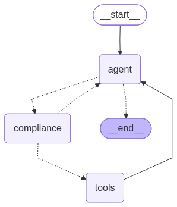

# 🤖 自主採購代理人 (Autonomous Procurement Agent)

一個基於 LLM 的自主採購代理人，能自動查詢商品價格、進行合規審核，並在預算範圍內完成下單，無需人工介入。

---

## 📌 專案特色

- **自主決策**：Agent 能獨立完成「查價 → 審核 → 下單」的完整流程
- **合規審核機制**：在工具執行前攔截超預算的下單請求，而非事後處理
- **自動修正**：被攔截後，Agent 能自主重新計算預算內最大可購買數量並重新下單
- **完整 Agentic Loop**：基於 LangGraph 實作，支援多節點、條件路由與狀態管理

---

## 🏗️ 系統架構



整個系統由三個節點組成，並透過條件路由串聯：

- **`agent`**：核心推理節點，驅動 GPT-4o 分析當前狀況並決定下一步行動（查價或下單）。每次工具回傳結果後都會回到此節點重新判斷。
- **`compliance`**：審核節點，在工具實際執行「之前」攔截所有下單請求，驗證總金額是否超出預算。若超標，會將拒絕訊息與修正建議回傳給 Agent，觸發重新計算；若合規，才放行進入工具執行。
- **`tools`**：工具執行節點，負責實際呼叫 `check_item_price`（查詢單價）與 `place_order`（執行下單）。

圖中虛線代表條件路由，實線代表固定流程。Agent 與 Compliance 之間的雙向虛線，體現了「審核未通過 → 退回重算 → 再次審核」的自我修正迴圈。

---

## ⚙️ 如何執行

### 1. 安裝依賴套件

```bash
pip install -r requirements.txt
```

### 2. 設定環境變數

在專案根目錄建立 `.env` 檔案：

```
OPENAI_API_KEY=你的_OpenAI_API_Key
```

### 3. 執行程式

```bash
python Procurement_Agent.py
```

執行後會出現選單，可選擇：
- `1`：產出系統架構流程圖
- `2`：超標測試（購買 5 個 Mouse，預算 $500，會被攔截並自動修正）
- `3`：合規測試（購買 4 個 Mouse，應直接通過）

---

## 🧪 執行範例

**情境：購買 5 個 Pro Mouse，預算 $500，單價 $120**

```
[Step 1] Agent 決定：呼叫 check_item_price
[Step 2] Tool 執行結果：120
[Step 3] Agent 決定：呼叫 place_order（5 個，$600）

🔍 [審核節點] 檢測到下單意圖：5 個 Pro Mouse，總額 $600
❌ [審核攔截] 總額 $600 超過預算 $500！
🔄 [路由] 審核未通過，退回 Agent 重新思考

[Step 4] Agent 決定：呼叫 place_order（4 個，$480）
✅ [審核通過] 總額 $480 符合預算 $500

🎯 最終結果：SUCCESS: 已下單 4 個 Pro Mouse，總金額 $480
🔄 修正次數：1
```

---

## 📁 專案結構

```
procurement-agent/
├── Procurement_Agent.py   # 主程式（Agent 邏輯、節點、流程）
├── requirements.txt       # 依賴套件清單
├── .gitignore             # 排除 venv、.env 等敏感資料
└── README.md              # 本文件
```

---

## 🔮 未來規劃

- [ ] 模組化重構（拆分 agent、tools、nodes、routes）
- [ ] 加入 Docker 容器化
- [ ] 串接 FastAPI / Streamlit，提供 Web 介面
- [ ] 擴充商品資料庫（連接真實 API）
- [ ] 多層級審核機制（主管審批流程）
